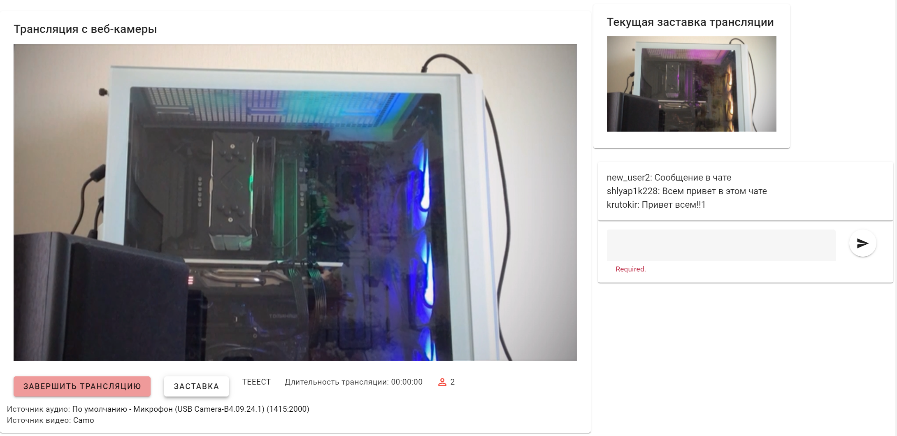
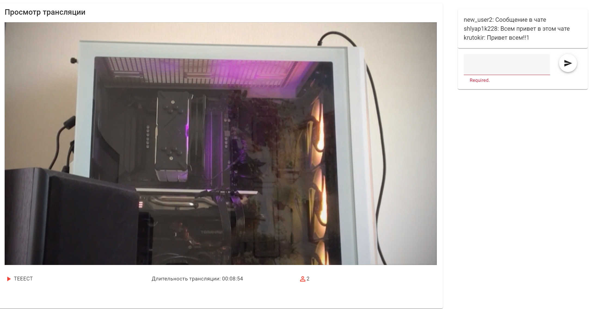

# Streaming App

Twitch-like application on WebRTC

## Server setup


```
cd server
npm install
npm start
```
The configuration file for backend is located at `server/config/config.js`

By default server runs on `http://localhost:8081`

## Client setup

```
cd client
npm install
npm run dev/build
```
On the frontend, the configuration file is located at `client/src/.env` and contains the following variables that need to be specified:

```
VITE_SERVER=http://localhost:8081
VITE_SOCKET_SERVER=http://localhost:8081
```

By default client runs on `http://localhost:3000`

# Examples

## Streamer's view



## List of streams


## Watcher's view


